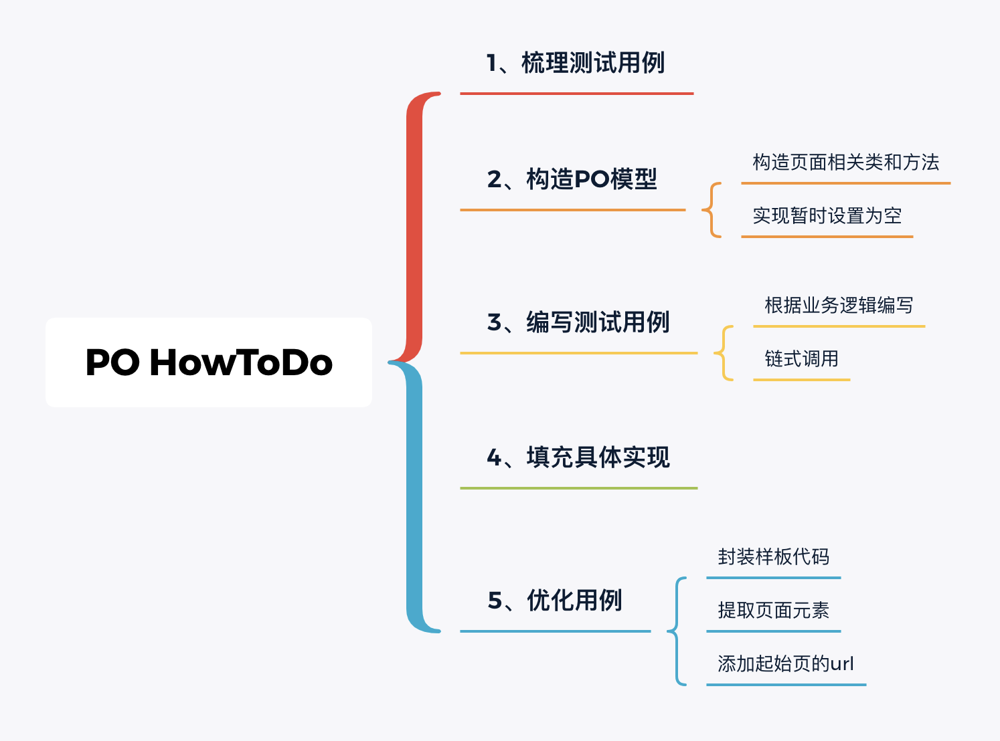
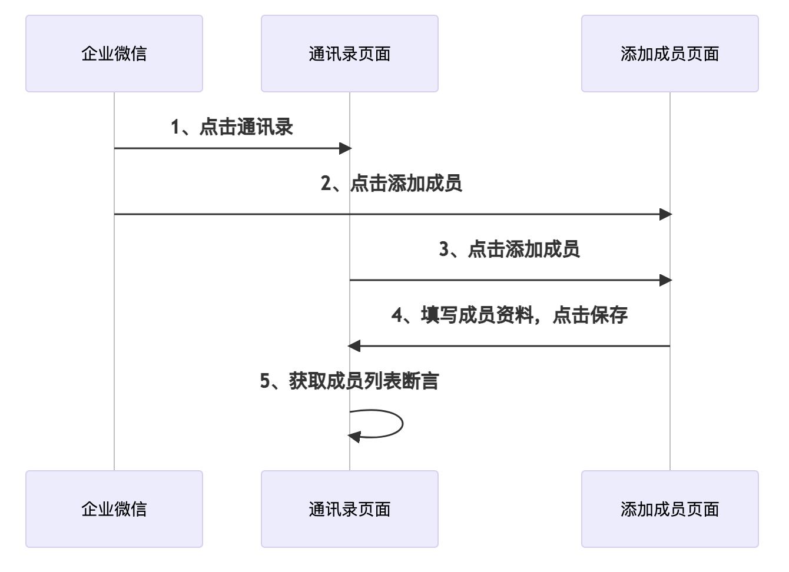

### PO六大原则
#### 方法意义  
    * 用公共方法代表UI所提供的功能  
    * 方法应该返回其他的PageObject或者返回用于断言的数据  
    * 同样的行为不同的结果可以建模为不同的方法  
    * 不要在方法内加断言  

#### 字段意义  
    * 不要暴露页面内部的元素给外部  
    * 不需要建模UI内的所有元素  

PO构造WEB自动化测试流程

企业WX web版PO开发时序图

